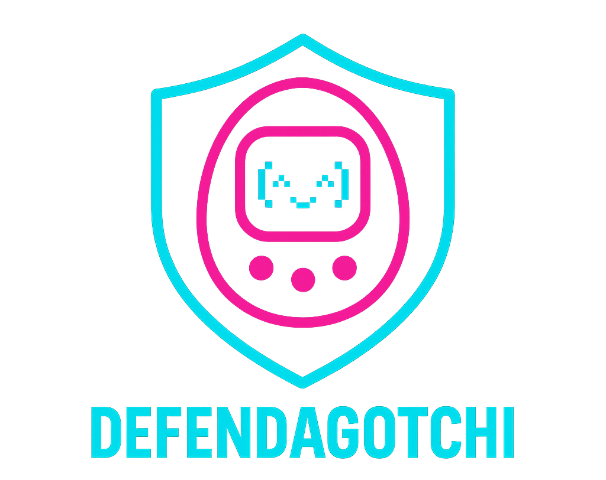

<p align="center">
  
</p>

<p align="center"><i>Cute UI. Serious signals. Raise a cyber‑pet. Unlock Wi‑Fi scans.</i></p>

<p align="center">
  
  
  
</p>

---

## What it is
A playful companion for Wi‑Fi hygiene. You level up by caring for the pet. As it grows you unlock scanners you can run on demand: deauth detector, rogue‑AP check, captive‑portal test, channel crowding, and weak‑encryption report. Fun to use. Useful in the field.

---

## Highlights
- Touch‑first portrait UI with fast redraws
- Background monitoring with gentle, throttled alerts
- **Work Mode (Level 10)** — pause care and access all scanners
- 13 built‑in themes: Hacker, Vaporwave, Gameboy, and more

---

## Abilities
| Lvl | Ability | What it does |
|---:|---|---|
| 2 | **Deauth detector** | Counts deauth/disassoc frames while channel hopping. |
| 4 | **Rogue AP finder** | Flags SSID clones with different BSSIDs. |
| 6 | **Portal check** | HTTP‑204 test to catch captive portals and redirects. |
| 8 | **Channel overlap** | Reports the most crowded 2.4 GHz channels. |
| 10 | **Weak encryption** | Counts Open and WEP APs in view. |

---

## Quick start
1. Add ESP32 support and install: `Adafruit_GFX`, `Adafruit_ILI9341`, `XPT2046_Touchscreen`, `WiFi`, `HTTPClient`.
2. Open **Defendagotchi_ESP32_ILI9341_FIXED.ino**. Keep portrait rotation.
3. Flash. Tap **Feed / Pet / Play / Abilities / Settings**. Toggle **Work Mode** at L10.

**Pins (defaults)**
```text
VSPI : SCK=18  MISO=19  MOSI=23
TFT  : CS=5  DC=2  RST=4        (RST=-1 ⇒ tie to EN)
TOUCH: CS=15 IRQ=27
BTN  : Feed=32 Pet=33 Play=25 Abilities=26 Work=21 Settings=13
```

**Config (optional)**
```cpp
#define HOME_SSID "YourWiFiName"  // focus Rogue‑AP checks
#define TOUCH_SWAP_XY 1           // fix rotated/mirrored touch if needed
#define TOUCH_FLIP_X  0
#define TOUCH_FLIP_Y  0
```

---

## Ethics & License
Detection and education only. Test on networks you own or are authorized to assess.  
Licensed under **MIT**. PRs welcome.
